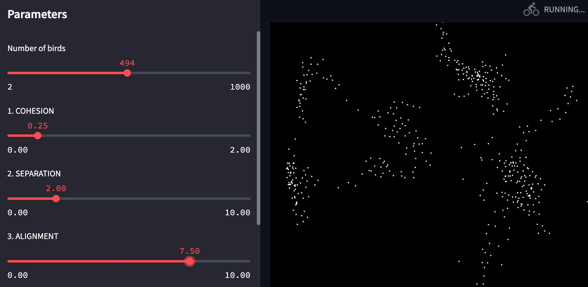

# Boids algorithm animation with Streamlit
Full explaination here: https://frapria.github.io/blog/streamlit_app 


1. Clone the repository:
```sh
git clone https://github.com/FraPria/boids_algorithm_app.git
```

2. install the requirments:
```sh
cd boids_algorithm_app
pip install -r requirements.txt
```

3. Run the code with:
```sh
streamlit run app.py 
```
This command will prompt the Local URL where you can find your app running. So open up the browser and paste the URL.

4. Play with parameters and enjoy!